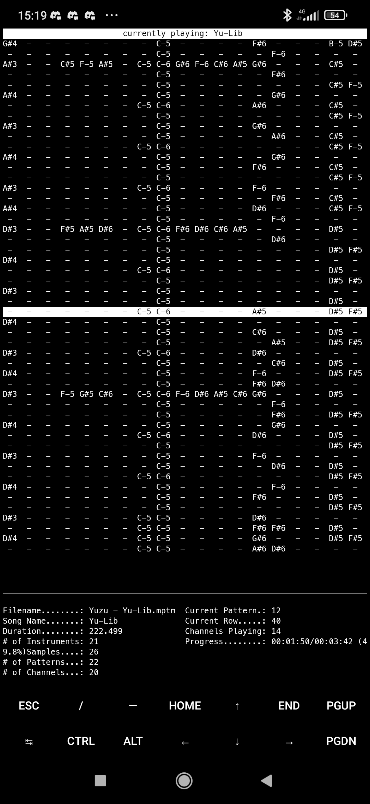
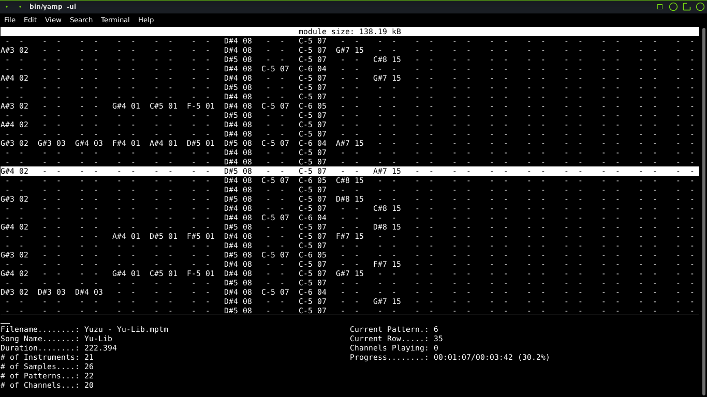

<div align="center">

# Yet Another Module Player
Simple but cool-lookin' module player written in pure C.

</div>

## History
YAMP (or "modplay") was originally made on my phone to test [libmodplug](https://github.com/Konstanty/libmodplug).  
After succeeding, I started adding more and more features (like argument parsing using argp, song information, UIs and [libopenmpt](https://lib.openmpt.org/libopenmpt/)).  
Eventually I realized that this is a pretty cool project, so I converted the folder to a git repo and uploaded it to GitHub.

## Usage
To play a file, just execute `yamp module_file.mod`.
Here is a list of available arguments:
```
 -l, --loop[=COUNT]      Loop song COUNT times, or infinitely if no COUNT provided.
 -s, --sample-rate=RATE  Set sample rate to RATE.
 -u, --ui                The "infamous" UI mode. (shown in screenshots)
 -v, --volume=AMOUNT     Set volume (0-100). (DOESN'T WORK RIGHT NOW)
```

## Screenshots


<br>
